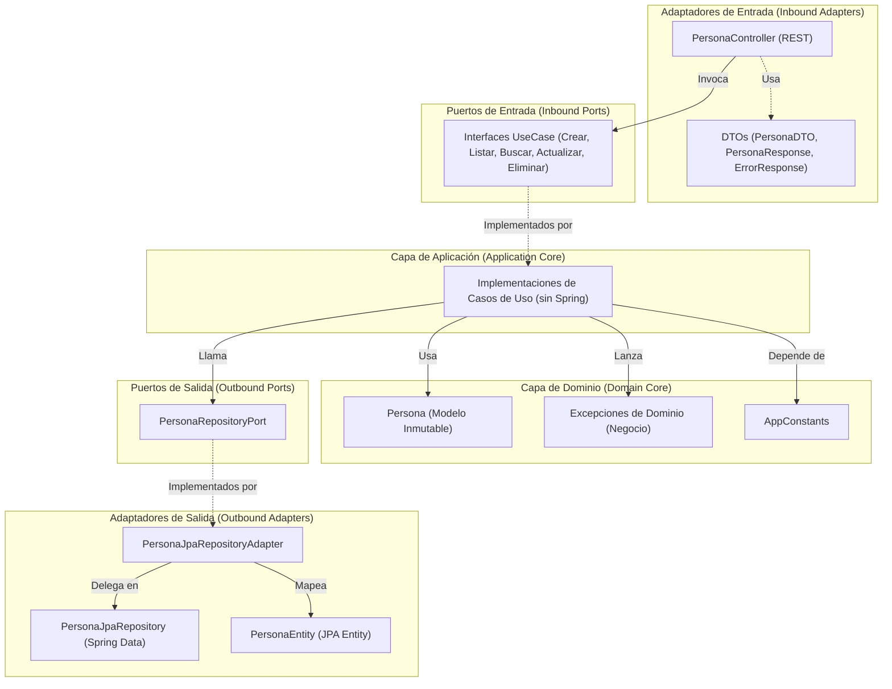

# CRUD Personas - Spring Boot

Proyecto backend desarrollado con Java y Spring Boot para la gestión de personas mediante una API REST, aplicando arquitectura por capas y buenas prácticas de desarrollo backend.

## Objetivo

Desarrollar una aplicación backend capaz de administrar información de personas, implementando una estructura organizada, mantenible y escalable mediante Spring Boot.

## Tecnologías utilizadas

- Java 17
- Spring Boot
- Maven
- Lombok
- Git & GitHub
- PostgreSQL

## Arquitectura del proyecto

El proyecto está organizado siguiendo una arquitectura por capas:

```text
controller  -> Manejo de endpoints REST
service     -> Lógica de negocio
repository  -> Acceso a datos
domain      -> Modelos del dominio
dto         -> Transferencia de datos
```

## Configuración

La aplicación se ejecuta en:

```text
http://localhost:8080
```

## Estructura base del proyecto

```text
src
 └── main
      ├── java
           └── org.ceiba.hu03
                ├── controller
                ├── service
                ├── repository
                ├── domain
                └── dto
```

## Principios SOLID Aplicados

## SRP - Single Responsibility Principle (Principio de Responsabilidad Única)

### Aplicación

Se separaron las responsabilidades de validación, persistencia y mapeo dentro de la aplicación.

- `Persona` quedó únicamente como entidad JPA.
- `PersonaDTO` asumió las validaciones de entrada.
- `PersonaMapper` centralizó la conversión entre entidad y DTO.
- `PersonaServiceImpl` se enfocó exclusivamente en la lógica de negocio.

### Archivos modificados

- Persona.java
- PersonaDTO.java
- PersonaMapper.java
- PersonaServiceImpl.java
- PersonaController.java

### Resultado

Cada componente posee una única responsabilidad, facilitando el mantenimiento y la escalabilidad del proyecto.

---

## OCP - Open/Closed Principle (Principio de Abierto/Cerrado)

### Aplicación

Se diseñó la capa de servicios para permitir la extensión de su comportamiento sin modificar los componentes existentes.

- Se definió la interfaz `PersonaService` que actúa como la abstracción del negocio de personas.
- Se renombró la clase concreta de servicio a `PersonaServiceImpl`, la cual implementa la interfaz.
- El controlador `PersonaController` se acopló a la interfaz en lugar de la implementación concreta, permitiendo intercambiar o extender la implementación en el futuro sin modificar el controlador.

### Archivos modificados

- PersonaService.java
- PersonaServiceImpl.java
- PersonaController.java

### Resultado

La capa de presentación y la capa de lógica de negocio están desacopladas a través de contratos, haciendo que el sistema esté abierto a nuevas extensiones pero cerrado a modificaciones directas.

---

## LSP - Liskov Substitution Principle (Principio de Sustitución de Liskov)

### Aplicación

Se validó la jerarquía de herencia e implementaciones del proyecto para garantizar la correcta sustituibilidad de componentes.

- `PersonaServiceImpl` implementa de forma íntegra el contrato de la interfaz `PersonaService` sin alterar las condiciones esperadas por sus consumidores.
- Las excepciones personalizadas heredan de `RuntimeException` sin alterar su comportamiento base, siendo gestionadas de forma polimórfica por el manejador global.
- `PersonaRepository` mantiene el uso correcto y la sustitución adecuada de `JpaRepository` sin requerir modificaciones adicionales.

### Archivos analizados

- PersonaService.java
- PersonaServiceImpl.java
- PersonaRepository.java
- Excepciones en el paquete org.ceiba.hu03.exception

### Resultado

Las implementaciones y subclases son totalmente sustituibles por sus supertipos sin alterar la corrección del programa, lo que fue verificado exitosamente mediante la suite de pruebas.

---

## ISP - Interface Segregation Principle (Principio de Segregación de Interfaces)

### Aplicación

Se redujo el tamaño del contrato público de servicio para evitar que sus clientes dependan de métodos que no utilizan.

- Se eliminó el método `buscarPorCedula(Long)` (que retornaba la entidad `Persona`) de la interfaz pública `PersonaService` al no ser consumido por el controlador REST.
- Dicho método se mantuvo únicamente dentro de la clase de implementación `PersonaServiceImpl` como método interno auxiliar de persistencia y lógica de negocio.

### Archivos modificados

- PersonaService.java
- PersonaServiceImpl.java

### Resultado

La interfaz `PersonaService` quedó segregada a lo estrictamente necesario para su cliente (`PersonaController`), promoviendo interfaces pequeñas, específicas y cohesivas.

---

## DIP - Dependency Inversion Principle (Principio de Inversión de Dependencias)

### Aplicación

Se invirtió la dirección de las dependencias inyectando abstracciones y eliminando acoplamientos directos.

- `PersonaController` depende de la interfaz `PersonaService` en lugar de su clase de implementación concreta.
- `PersonaServiceImpl` depende de la interfaz `PersonaRepository` en lugar de una clase de infraestructura concreta.
- Las dependencias son inyectadas mediante constructor.
- Se analizó que las instanciaciones directas (uso de `new`) corresponden únicamente a estructuras de datos pasivas (DTOs, respuestas y excepciones), lo cual es correcto dentro de DIP.

### Archivos modificados

- PersonaController.java
- PersonaServiceImpl.java

### Resultado

Los módulos de alto nivel no dependen de módulos de bajo nivel, sino de abstracciones, logrando un desacoplamiento administrado de forma limpia por Spring Boot.

---

## Conclusión

El proyecto implementa un diseño limpio y desacoplado alineado con las buenas prácticas de desarrollo empresarial. La aplicación estructurada de los principios SOLID garantiza que el CRUD de personas sea altamente mantenible, extensible y testeable ante cualquier cambio futuro en los requerimientos del negocio.

---

## Evolución a Arquitectura Hexagonal (Puertos y Adaptadores)

Para mejorar aún más la mantenibilidad y desacoplar completamente las reglas de negocio de los detalles tecnológicos (bases de datos, frameworks de presentación, etc.), el proyecto evolucionó a una **Arquitectura Hexagonal**.

### Diagrama de la Nueva Arquitectura Hexagonal



### Nueva Estructura del Proyecto

```text
src
 └── main
      ├── java
           └── org.ceiba.hu03
                ├── domain
                │    ├── model (Persona)
                │    ├── constant (AppConstants)
                │    ├── port (in/out)
                │    └── exception (Excepciones del negocio)
                ├── application
                │    └── usecase (Implementaciones de casos de uso sin Spring)
                └── infrastructure
                     ├── persistence (Entidades, Repositorios JPA y Adaptadores)
                     ├── controller (Controlador REST y DTOs)
                     ├── mapper (Mapeadores de infraestructura)
                     ├── exception (Manejador de excepciones global)
                     └── config (Configuración de Beans de Spring)
```

---

## Estrategia de Seguridad Perimetral: Rate Limiting (SCRUM-113)

Con el fin de mitigar ataques de denegación de servicio (DoS/DDoS) y abusos automatizados a la API, se ha diseñado una estrategia conceptual de control de tráfico y limitación de tasa de solicitudes (**Rate Limiting**). Esta estrategia mitiga directamente los riesgos **OWASP A04:2021-Insecure Design** y **OWASP API04:2023-Unrestricted Resource Consumption**.

### Justificación Arquitectónica (Arquitectura Hexagonal)
En la **Arquitectura Hexagonal**, el núcleo del dominio y la capa de aplicación deben ser completamente puros y enfocarse únicamente en el modelo y las reglas del negocio (p. ej., validación de cédulas, unicidad de correos). El flujo y control del tráfico HTTP representan una preocupación de transporte y comunicación externa. 

Por lo tanto, la limitación de tasa se delega como un mecanismo de **Infraestructura** (Filtro HTTP perimetral, Gateway de la API o Proxy Inverso como Nginx), asegurando que las solicitudes excesivas sean rechazadas en la periferia de la aplicación sin consumir recursos del núcleo del sistema ni interactuar con la lógica del dominio.

### Mecanismo de Respuesta del Control de Tasa
Cuando un cliente exceda el límite de solicitudes permitido dentro de una ventana de tiempo predefinida:
1.  **Código de Estado HTTP:** El servidor responderá con un código **HTTP 429 Too Many Requests**, indicando que se ha superado la tasa permitida.
2.  **Cabeceras de Control de Tasa (Headers):** Se inyectarán cabeceras estándar en la respuesta HTTP para guiar al cliente sobre su estado:
    *   `X-RateLimit-Limit`: Número máximo de solicitudes permitidas en el período.
    *   `X-RateLimit-Remaining`: Número de solicitudes restantes dentro de la ventana de tiempo actual.
    *   `X-RateLimit-Reset`: Tiempo restante (en segundos o timestamp) para el reinicio y renovación del límite.
    *   `Retry-After`: Cabecera estándar que especifica el número de segundos que el cliente debe esperar antes de realizar una nueva solicitud.

### Diseño del Algoritmo de Tasa (Token Bucket) y Umbrales SLA
La estrategia conceptual se basa en el algoritmo **Token Bucket (Cubo de Fichas)**:
*   Cada cliente (identificado por su dirección IP o token de API) tiene asociado un "cubo" virtual con capacidad máxima para una cantidad de tokens de acceso fija según el tipo de operación.
*   Cada solicitud exitosa consume exactamente 1 token del cubo del cliente.
*   Si el cubo está vacío (0 tokens), las nuevas solicitudes son rechazadas inmediatamente retornando el error HTTP 429.
*   Los tokens se rellenan y regeneran a una velocidad constante predefinida hasta alcanzar nuevamente la capacidad máxima del cubo, permitiendo absorber picos de tráfico controlados de forma segura.

#### Umbrales SLA Definidos:
*   **Endpoints de Lectura (GET):** Capacidad máxima de 60 tokens (solicitudes) por minuto, con una tasa de recarga constante de 1 token por segundo.
*   **Endpoints de Mutación (POST/PUT/DELETE):** Capacidad máxima de 10 tokens por minuto, para prevenir ataques de fuerza bruta, abuso de recursos del servidor o duplicación accidental/maliciosa de datos de personas.

### Observabilidad de Seguridad
Cada evento de rechazo (HTTP 429) es registrado en los componentes de monitoreo de la infraestructura (`log.warn` en el filtro perimetral o mediante telemetría) capturando el timestamp, la IP de origen y el endpoint solicitado. Esto permite configurar alertas en tiempo real y detectar patrones de ataques distribuidos antes de que impacten la disponibilidad del servicio.