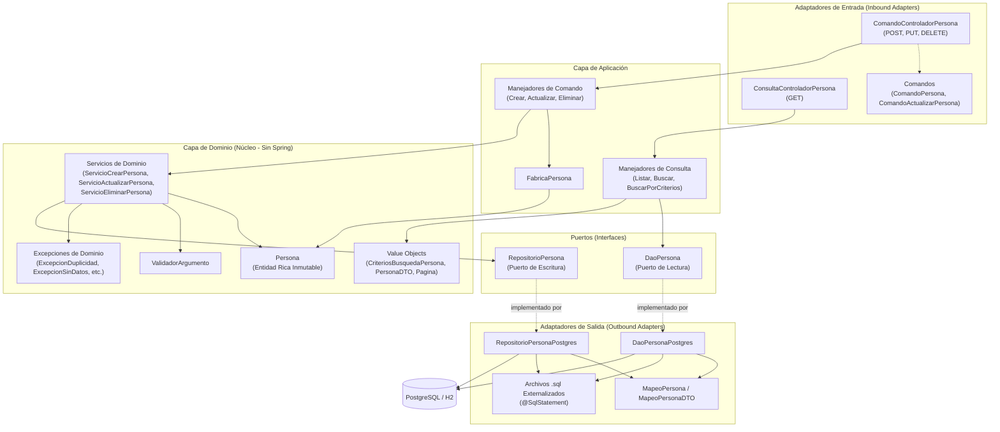

# CRUD Personas - API REST (Arquitectura Hexagonal & DDD)

Este proyecto backend implementa una **API REST para la gestión de personas**, desarrollada en Java 21 con Spring Boot 3.3.x. Fue diseñado bajo los principios de **Domain-Driven Design (DDD)**, **Arquitectura Hexagonal (Puertos y Adaptadores)** y **patrón CQRS (Command Query Responsibility Segregation)**, con cumplimiento riguroso de los principios **SOLID** para garantizar un núcleo de negocio agnóstico, desacoplado, testeable y escalable.

> **Organización:** Ceiba Software  
> **Módulo:** `ms-personas` (Microservicio de Personas)  
> **Versión:** 0.0.1-SNAPSHOT

---

## Tabla de Contenidos

- [Arquitectura y Patrones de Diseño](#arquitectura-y-patrones-de-diseño)
- [Diagrama de Arquitectura Hexagonal](#diagrama-de-arquitectura-hexagonal)
- [Especificaciones Técnicas](#especificaciones-técnicas)
- [Estructura del Proyecto](#estructura-del-proyecto)
- [Principios SOLID Aplicados](#principios-solid-aplicados)
- [Estrategia de Seguridad Perimetral](#estrategia-de-seguridad-perimetral-rate-limiting-scrum-113)
- [Instalación y Despliegue con Docker](#instalación-y-despliegue-con-docker)
- [Guía de Uso de la API (Endpoints)](#guía-de-uso-de-la-api-endpoints)
- [Documentación Interactiva (Swagger / OpenAPI)](#documentación-interactiva-swagger--openapi)
- [Pruebas y Calidad de Código](#pruebas-y-calidad-de-código)

---

## Arquitectura y Patrones de Diseño

### Arquitectura Hexagonal (Puertos y Adaptadores)

El proyecto fomenta que el **dominio sea el núcleo agnóstico de la aplicación**, aislándolo completamente de frameworks, bases de datos o mecanismos de transporte. El sistema se estructura como un **proyecto Gradle multi-módulo** dividido en tres capas principales:

- **Dominio (`dominio`)**: Contiene la lógica central y reglas de negocio **sin ninguna dependencia de Spring Boot**.
  - **Modelo / Entidad Rica**: `Persona` — entidad de dominio inmutable con validaciones de negocio autocontenidas en el constructor (Guard Clauses), cálculo de edad y actualización funcional.
  - **Value Objects / DTOs de Dominio**: `CriteriosBusquedaPersona` (criterios de búsqueda con validación de ordenamiento, paginación y rango de edades), `PersonaDTO` (proyección de lectura inmutable), `Pagina<T>` (abstracción genérica de paginación).
  - **Puertos de Salida**: `RepositorioPersona` (interfaz de escritura: guardar, obtener, actualizar, eliminar, verificar existencia) y `DaoPersona` (interfaz de lectura: listar, buscar por cédula, búsqueda paginada por criterios).
  - **Validaciones & Guard Clauses**: `ValidadorArgumento` — utilidad estática pura para validar campos obligatorios y expresiones regulares.
  - **Excepciones de Dominio Puras**: `ExcepcionDuplicidad`, `ExcepcionSinDatos`, `ExcepcionValorInvalido`, `ExcepcionValorObligatorio`, `ExcepcionLongitudValor`.
  - **Servicios de Dominio**: `ServicioCrearPersona`, `ServicioActualizarPersona`, `ServicioEliminarPersona` — orquestan las reglas de negocio de cada caso de uso sin dependencia de Spring.

- **Aplicación (`aplicacion`)**: Coordina la ejecución de los casos de uso, transformando comandos de transporte en invocaciones al dominio.
  - **Comandos (DTOs de entrada)**: `ComandoPersona` (record para creación), `ComandoActualizarPersona` (record para actualización), `ComandoEliminarPersona` (record para eliminación).
  - **Fábrica**: `FabricaPersona` — transforma comandos en entidades de dominio.
  - **Manejadores de Comando**: `ManejadorCrearPersona`, `ManejadorActualizarPersona`, `ManejadorEliminarPersona`.
  - **Manejadores de Consulta**: `ManejadorListarPersonas`, `ManejadorBuscarPersonaPorCedula`, `ManejadorBuscarPersonasPorCriterios`.

- **Infraestructura (`infraestructura`)**: Implementa los detalles tecnológicos y adaptadores concretos de Spring Boot.
  - **Adaptadores de Entrada (REST)**: `ComandoControladorPersona` (POST, PUT, DELETE) y `ConsultaControladorPersona` (GET listar, GET por cédula, GET búsqueda paginada). Documentados con interfaces separadas de OpenAPI (`ComandoControladorPersonaApiDoc`, `ConsultaControladorPersonaApiDoc`).
  - **Adaptadores de Salida (Persistencia)**: `RepositorioPersonaPostgres` y `DaoPersonaPostgres` — implementaciones JDBC/PostgreSQL que utilizan `CustomNamedParameterJdbcTemplate` con sentencias SQL externalizadas en archivos `.sql` vía la anotación `@SqlStatement`.
  - **Mapeadores Relacionales**: `MapeoPersona` (RowMapper → entidad de dominio `Persona`) y `MapeoPersonaDTO` (RowMapper → `PersonaDTO`).
  - **Configuración**: `BeanServicio` (registro manual de servicios de dominio como `@Bean`), `ConfiguracionSwagger` (OpenAPI 3.0), `ConfiguracionHeader`, `ConfiguracionHikari`, `ConfiguracionJackson`.
  - **Seguridad**: `FiltroHeaderSeguridad` (inyección de cabeceras HTTP de seguridad: `X-Frame-Options`, `X-Content-Type-Options`, `X-XSS-Protection`, `Pragma`).
  - **Manejo Global de Errores**: `ManejadorError` (`@ControllerAdvice`) — mapea excepciones de dominio a códigos HTTP estándar.

### Patrón CQRS (Command Query Responsibility Segregation)

El proyecto implementa una separación explícita entre operaciones de escritura (**Commands**) y lectura (**Queries**):

| Responsabilidad                             | Controlador                  | Manejadores                                                                      | Puerto               |
| ------------------------------------------- | ---------------------------- | -------------------------------------------------------------------------------- | -------------------- |
| **Escritura** (Crear, Actualizar, Eliminar) | `ComandoControladorPersona`  | `ManejadorCrearPersona`, `ManejadorActualizarPersona`, `ManejadorEliminarPersona` | `RepositorioPersona` |
| **Lectura** (Listar, Buscar, Búsqueda)      | `ConsultaControladorPersona` | `ManejadorListarPersonas`, `ManejadorBuscarPersonaPorCedula`, `ManejadorBuscar` | `DaoPersona`         |

---

## Diagrama de Arquitectura Hexagonal


```mermaid
graph TD
    subgraph "Adaptadores de Entrada (Inbound Adapters)"
        CMD["ComandoControladorPersona<br/>(POST, PUT, DELETE)"]
        QRY["ConsultaControladorPersona<br/>(GET)"]
        CMDDTO["Comandos<br/>(ComandoPersona, ComandoActualizarPersona)"]
    end

    subgraph "Capa de Aplicación"
        FAB["FabricaPersona"]
        MCMD["Manejadores de Comando<br/>(Crear, Actualizar, Eliminar)"]
        MQRY["Manejadores de Consulta<br/>(Listar, Buscar, BuscarPorCriterios)"]
    end

    subgraph "Capa de Dominio (Núcleo - Sin Spring)"
        SVC["Servicios de Dominio<br/>(ServicioCrearPersona, ServicioActualizarPersona,<br/>ServicioEliminarPersona)"]
        MOD["Persona<br/>(Entidad Rica Inmutable)"]
        VAL["ValidadorArgumento"]
        EXC["Excepciones de Dominio<br/>(ExcepcionDuplicidad, ExcepcionSinDatos, etc.)"]
        VO["Value Objects<br/>(CriteriosBusquedaPersona, PersonaDTO, Pagina)"]
    end

    subgraph "Puertos (Interfaces)"
        REPO["RepositorioPersona<br/>(Puerto de Escritura)"]
        DAO["DaoPersona<br/>(Puerto de Lectura)"]
    end

    subgraph "Adaptadores de Salida (Outbound Adapters)"
        REPOIMPL["RepositorioPersonaPostgres"]
        DAOIMPL["DaoPersonaPostgres"]
        MAP["MapeoPersona / MapeoPersonaDTO"]
        SQL["Archivos .sql Externalizados<br/>(@SqlStatement)"]
    end

    BD[("PostgreSQL / H2")]

    CMD -.-> CMDDTO
    CMD --> MCMD
    QRY --> MQRY
    MCMD --> FAB
    FAB --> MOD
    MCMD --> SVC
    SVC --> MOD
    SVC --> VAL
    SVC --> EXC
    SVC --> REPO
    MQRY --> DAO
    MQRY --> VO
    REPO -.->|"implementado por"| REPOIMPL
    DAO -.->|"implementado por"| DAOIMPL
    REPOIMPL --> MAP
    DAOIMPL --> MAP
    REPOIMPL --> SQL
    DAOIMPL --> SQL
    REPOIMPL --> BD
    DAOIMPL --> BD
```

### Diagrama ASCII (Alternativo)

```text
               +-------------------------------------------------------+
               |                  INFRAESTRUCTURA                      |
               |                                                       |
               |   +-----------------------------------------------+   |
               |   |                  APLICACIÓN                   |   |
               |   |                                               |   |
  [ HTTP ] ------> |  [ ComandoControladorPersona ]                |   |
               |   |  [ ConsultaControladorPersona ]               |   |
               |   |        |                                      |   |
               |   |  (Manejadores de Comando / Consulta)          |   |
               |   |  (FabricaPersona)                             |   |
               |   |        |                                      |   |
               |   |   +----+---------------------------------+    |   |
               |   |   |                DOMINIO               |    |   |
               |   |   |          (Sin Spring Boot)           |    |   |
               |   |   |                                      |    |   |
               |   |   |   [ ServicioCrear / Actualizar /     |    |   |
               |   |   |     Eliminar Persona ]               |    |   |
               |   |   |              |                       |    |   |
               |   |   |   [ Persona (Entidad Inmutable) /    |    |   |
               |   |   |     ValidadorArgumento ]             |    |   |
               |   |   |              |                       |    |   |
               |   |   |  (Puertos: RepositorioPersona /      |    |   |
               |   |   |             DaoPersona)              |    |   |
               |   |   +--------------+-----------------------+    |   |
               |   |                  |                            |   |
               |   +------------------|----------------------------+   |
               |                      v                                |
               |   [ RepositorioPersonaPostgres / DaoPersonaPostgres ] |
               |          |               |                            |
               |   [ MapeoPersona ]  [ @SqlStatement .sql files ]      |
               |          |                                            |
               |          v                                            |
               |   [ PostgreSQL / H2 (Test) ]                          |
               +-------------------------------------------------------+
```

---

## Especificaciones Técnicas

| Categoría                     | Tecnología                                                           |
| ----------------------------- | -------------------------------------------------------------------- |
| **Lenguaje**                  | Java 21                                                              |
| **Framework**                 | Spring Boot 3.3.7 (Spring Framework 6.1.14)                          |
| **Servidor Embebido**         | Undertow (Tomcat excluido)                                           |
| **Gestor de Construcción**     | Gradle 8.12 (Wrapper embebido)                                       |
| **Persistencia (Producción)** | PostgreSQL 15 Alpine (driver 42.7.4)                                 |
| **Persistencia (Pruebas)**    | H2 In-Memory 2.2.224                                                 |
| **Acceso a Datos**            | `NamedParameterJdbcTemplate` + SQL externalizado (`@SqlStatement`)   |
| **Migraciones de BD**         | Flyway 10.22.0                                                       |
| **Documentación API**         | SpringDoc OpenAPI 2.3.0 (Swagger UI)                                 |
| **Contenedorización**         | Docker + Docker Compose 3.8                                          |
| **Pool de Conexiones**        | HikariCP                                                             |
| **Serialización**             | Jackson (configuración personalizada)                                |
| **Pruebas Unitarias**         | JUnit 5, Mockito 3.11.2, AssertJ                                     |
| **Pruebas de Arquitectura**   | ArchUnit 1.3.0                                                       |
| **Pruebas de Mutación**       | PITest 1.15.0 (umbral de mutación ≥ 90%)                             |
| **Cobertura de Código**       | JaCoCo (reporte XML automático)                                      |
| **Análisis de Seguridad**     | OWASP Dependency Check 8.4.3                                         |
| **Licencias**                 | Dependency License Report                                            |

---

## Estructura del Proyecto

El proyecto sigue una arquitectura **multi-módulo Gradle** con separación entre el módulo `comun` (librería transversal de Ceiba) y el `microservicio` (lógica de negocio de personas):

```text
ms-personas/
 ├── .env                                       ← Variables de entorno (Docker Compose)
 ├── Dockerfile                                 ← Build multi-stage (Gradle → JRE Alpine)
 ├── docker-compose.yml                         ← Orquestación PostgreSQL + Backend
 ├── postman/
 │    └── ms-personas-api.postman_collection.json  ← Colección Postman de la API
 │
 ├── comun/                                     ← Módulo transversal (Ceiba Software)
 │    ├── comun-dominio/
 │    │    └── ceiba.com.co.dominio/
 │    │         ├── excepcion/                  ← Excepciones puras de negocio
 │    │         │    ├── ExcepcionDuplicidad
 │    │         │    ├── ExcepcionLongitudValor
 │    │         │    ├── ExcepcionSinDatos
 │    │         │    ├── ExcepcionValorInvalido
 │    │         │    └── ExcepcionValorObligatorio
 │    │         └── ValidadorArgumento.java     ← Guard Clauses reutilizable
 │    │
 │    ├── comun-aplicacion/
 │    │    └── ceiba.com.co/
 │    │         ├── ComandoRespuesta.java       ← Wrapper genérico de respuesta
 │    │         └── manejador/                  ← Interfaces genéricas de Manejadores
 │    │              ├── ManejadorComando.java
 │    │              └── ManejadorComandoRespuesta.java
 │    │
 │    └── comun-infraestructura/
 │         └── ceiba.com.co.infraestructura/
 │              ├── configuracion/              ← Swagger, CORS, Hikari, Jackson
 │              ├── error/                      ← ManejadorError (@ControllerAdvice)
 │              ├── filtro/                     ← FiltroHeaderSeguridad (HTTP headers)
 │              ├── jdbc/                       ← CustomNamedParameterJdbcTemplate,
 │              │                                  @SqlStatement, EjecucionBaseDeDatos
 │              └── excepcion/                  ← ExcepcionTecnica
 │
 └── microservicio/                             ← Módulo principal del microservicio
      ├── settings.gradle                       ← Definición multi-módulo
      ├── gradle.properties                     ← springBootVersion=3.3.7
      │
      ├── dominio/                              ← Núcleo del Negocio (SIN SPRING)
      │    └── ceiba.com.co/
      │         ├── modelo/
      │         │    ├── entidad/
      │         │    │    └── Persona.java          ← Entidad rica e inmutable
      │         │    └── dto/
      │         │         ├── PersonaDTO.java       ← Proyección de lectura
      │         │         ├── CriteriosBusquedaPersona.java  ← Value Object búsqueda
      │         │         └── Pagina.java           ← VO genérico de paginación
      │         └── puerto/
      │              ├── repositorio/
      │              │    └── RepositorioPersona.java  ← Puerto de escritura
      │              └── dao/
      │                   └── DaoPersona.java          ← Puerto de lectura
      │         └── servicio/                   ← Servicios de Dominio
      │              ├── ServicioCrearPersona.java
      │              ├── ServicioActualizarPersona.java
      │              └── ServicioEliminarPersona.java
      │
      ├── aplicacion/                           ← Orquestación de Casos de Uso
      │    └── ceiba.com.co/
      │         ├── comando/
      │         │    ├── ComandoPersona.java            ← Record de creación
      │         │    ├── ComandoActualizarPersona.java  ← Record de actualización
      │         │    ├── ComandoEliminarPersona.java    ← Record de eliminación
      │         │    ├── fabrica/
      │         │    │    └── FabricaPersona.java       ← Factory: Comando → Entidad
      │         │    └── manejador/
      │         │         ├── ManejadorCrearPersona.java
      │         │         ├── ManejadorActualizarPersona.java
      │         │         └── ManejadorEliminarPersona.java
      │         └── consulta/
      │              ├── ManejadorListarPersonas.java
      │              ├── ManejadorBuscarPersonaPorCedula.java
      │              └── ManejadorBuscarPersonasPorCriterios.java
      │
      ├── infraestructura/                      ← Detalles Tecnológicos (Spring Boot)
      │    └── ceiba.com.co/
      │         ├── configuracion/
      │         │    └── BeanServicio.java      ← Registra servicios de dominio como @Bean
      │         └── dominio/
      │              ├── adaptador/
      │              │    ├── repositorio/      ← Adaptador de escritura (PostgreSQL)
      │              │    │    ├── RepositorioPersonaPostgres.java
      │              │    │    └── MapeoPersona.java (RowMapper)
      │              │    └── dao/              ← Adaptador de lectura (PostgreSQL)
      │              │         ├── DaoPersonaPostgres.java
      │              │         └── MapeoPersonaDTO.java (RowMapper)
      │              └── controlador/           ← Adaptadores REST de Entrada
      │                   ├── ComandoControladorPersona.java
      │                   ├── ConsultaControladorPersona.java
      │                   └── doc/              ← Interfaces de documentación OpenAPI
      │                        ├── ComandoControladorPersonaApiDoc.java
      │                        └── ConsultaControladorPersonaApiDoc.java
      │
      ├── src/main/resources/
      │    ├── application.yaml                 ← Configuración principal (PostgreSQL, Flyway)
      │    └── db/migration/DDL/
      │         └── V1.0__crear_tabla_personas.sql  ← Migración Flyway (DDL)
      │
      └── infraestructura/src/main/resources/
           └── sql/persona/                     ← Sentencias SQL externalizadas
                ├── crear.sql
                ├── obtenerporcedula.sql
                ├── actualizar.sql
                ├── eliminar.sql
                ├── existeconcedula.sql
                ├── existeconemail.sql
                ├── listar.sql
                ├── buscarporcedula.sql
                └── buscarporcriteriosbase.sql
```

---

## Principios SOLID Aplicados

### SRP — Single Responsibility Principle

Separación estricta de responsabilidades en cada componente:

- `Persona` (dominio) → Entidad rica con validaciones de negocio autocontenidas.
- `PersonaDTO` (dominio) → Proyección inmutable de lectura.
- `ComandoPersona` / `ComandoActualizarPersona` (aplicación) → DTOs de transporte para comandos de escritura.
- `RepositorioPersonaPostgres` / `DaoPersonaPostgres` (infraestructura) → Persistencia relacional (escritura / lectura separadas).
- `ComandoControladorPersona` / `ConsultaControladorPersona` (infraestructura) → Controladores HTTP segregados por responsabilidad CQRS.

### OCP — Open/Closed Principle & DIP — Dependency Inversion Principle

Los servicios de dominio y los manejadores de aplicación dependen exclusivamente de **abstracciones** (interfaces `RepositorioPersona` y `DaoPersona`), inyectadas por constructor. Las implementaciones concretas (`RepositorioPersonaPostgres`, `DaoPersonaPostgres`) residen en infraestructura y pueden sustituirse sin modificar el dominio.

```java
// ServicioCrearPersona depende SOLO de la interfaz (puerto), nunca de PostgreSQL
public class ServicioCrearPersona {
  private final RepositorioPersona repositorioPersona; // Puerto de Salida
  // ...
}
```

### LSP — Liskov Substitution Principle

- `RepositorioPersonaPostgres` implementa fielmente el contrato de `RepositorioPersona`.
- `DaoPersonaPostgres` implementa fielmente el contrato de `DaoPersona`.
- Las excepciones de dominio (`ExcepcionDuplicidad`, `ExcepcionSinDatos`, etc.) extienden `RuntimeException` sin alterar su semántica base, siendo gestionadas polimórficamente por el `ManejadorError`.

### ISP — Interface Segregation Principle

Los puertos de salida están segregados según la naturaleza de la operación:

- `RepositorioPersona` → Solo operaciones de **escritura** (`guardar`, `actualizar`, `eliminar`, `existeConCedula`, `existeConEmail`).
- `DaoPersona` → Solo operaciones de **lectura** (`listar`, `buscarPorCedula`, `buscarPorCriterios`).

Ningún componente se ve forzado a depender de métodos que no necesita.

---

## Estrategia de Seguridad Perimetral: Rate Limiting (SCRUM-113)

Para mitigar ataques de denegación de servicio (DoS/DDoS) y abusos automatizados, se ha diseñado una estrategia de control de tráfico basada en el algoritmo **Token Bucket**, delegada a la capa de **Infraestructura perimetral** (coherente con Arquitectura Hexagonal):

### Justificación Arquitectónica

El núcleo del dominio y la capa de aplicación deben ser completamente puros y enfocarse únicamente en las reglas del negocio. El control de tráfico HTTP es una preocupación de transporte que se delega al perímetro (filtro HTTP, API Gateway o proxy inverso), rechazando solicitudes excesivas **antes** de que consuman recursos del dominio.

### Umbrales SLA Definidos

| Tipo de Operación                               | Capacidad Máxima | Recarga         |
| ----------------------------------------------- | ---------------- | --------------- |
| Endpoints de Lectura (`GET`)                    | 60 tokens/minuto | 1 token/segundo |
| Endpoints de Mutación (`POST`, `PUT`, `DELETE`) | 10 tokens/minuto | —               |

### Mecanismo de Respuesta

- **Código HTTP:** `429 Too Many Requests`
- **Cabeceras inyectadas:**
  - `X-RateLimit-Limit` — Máximo de solicitudes permitidas en el período.
  - `X-RateLimit-Remaining` — Solicitudes restantes en la ventana actual.
  - `X-RateLimit-Reset` — Tiempo hasta la renovación del límite.
  - `Retry-After` — Segundos que el cliente debe esperar.

### Cabeceras de Seguridad HTTP Implementadas

El filtro `FiltroHeaderSeguridad` inyecta las siguientes cabeceras en **todas** las respuestas:

| Cabecera                | Valor           | Propósito                              |
| ----------------------- | --------------- | -------------------------------------- |
| `X-XSS-Protection`      | `1; mode=block` | Protección contra Cross-Site Scripting |
| `X-Content-Type-Options` | `nosniff`       | Prevención de MIME sniffing            |
| `Pragma`                | `no-cache`      | Control de caché                       |
| `X-Frame-Options`       | `SAMEORIGIN`    | Protección contra clickjacking          |

---

## Instalación y Despliegue con Docker

### Requisitos Previos

- [Docker Desktop](https://www.docker.com/products/docker-desktop/) instalado y activo.
- Soporte para **WSL 2** (si utilizas Windows).
- Java 21+ y Git configurados (solo para desarrollo local sin Docker).

### Guía de Inicio Rápido

#### 1. Clonar el Repositorio

```bash
git clone <URL_DEL_REPOSITORIO>
cd ms-personas
```

#### 2. Configurar Variables de Entorno (`.env`)

Asegúrate de tener un archivo `.env` en la raíz del proyecto (al mismo nivel que `docker-compose.yml`) con la siguiente configuración:

```env
# Configuración de PostgreSQL
DB_USER=postgres
DB_PASSWORD=tu_contraseña_segura
DB_NAME=crud_personas
DB_PORT=5432

# Configuración del Backend
SERVER_PORT=8083
BACKEND_PORT=8083
```

#### 3. Construir y Desplegar los Contenedores

```bash
docker-compose up -d --build
```

Este comando:
- Levanta un contenedor **PostgreSQL 15 Alpine** con healthcheck integrado.
- Construye la imagen del backend con un **Dockerfile multi-stage** (Gradle 8.12 + JDK 21 → Eclipse Temurin 21 JRE Alpine).
- Ejecuta las **migraciones Flyway** automáticamente al iniciar la aplicación.
- Conecta ambos servicios en la red `ceiba-network`.

#### 4. Verificar el Estado de los Servicios

```bash
docker-compose ps
```

Resultado esperado:

```text
NAME                       STATUS         PORTS
personas-postgres-db       Up (healthy)   0.0.0.0:5432->5432/tcp
personas-spring-backend    Up (healthy)   0.0.0.0:8083->8083/tcp
```

#### 5. Detener los Servicios

```bash
docker-compose down
```

Para eliminar también los volúmenes de datos persistidos:

```bash
docker-compose down -v
```

---

## Guía de Uso de la API (Endpoints)

**Base URL:** `http://localhost:8083/api/personas`

### Endpoints de Consulta (GET)

| Método | Endpoint                | Descripción                             | Parámetros                                                               | Código Esperado            |
| ------ | ----------------------- | --------------------------------------- | ------------------------------------------------------------------------ | -------------------------- |
| `GET`  | `/api/personas`         | Lista todas las personas registradas.   | N/A                                                                      | `200 OK`                   |
| `GET`  | `/api/personas/{cedula}` | Busca una persona por número de cédula. | Path: `cedula` (Long)                                                    | `200 OK` / `404 Not Found` |
| `GET`  | `/api/personas/search`  | Búsqueda avanzada paginada con filtros. | Query: `nombre`, `apellido`, `edadMinima`, `edadMaxima`, `page`, `size`  | `200 OK` / `400 Bad Request` |

### Endpoints de Comando (POST, PUT, DELETE)

| Método   | Endpoint                | Descripción                                  | Body / Parámetros       | Código Esperado            |
| -------- | ----------------------- | -------------------------------------------- | ----------------------- | -------------------------- |
| `POST`   | `/api/personas`         | Registra una nueva persona en el sistema.    | JSON Body (ver ejemplo) | `201 Created`              |
| `PUT`    | `/api/personas/{cedula}` | Actualiza los datos de una persona existente.| Path: `cedula` + Body   | `200 OK` / `404 Not Found` |
| `DELETE` | `/api/personas/{cedula}` | Elimina una persona por número de cédula.    | Path: `cedula` (Long)   | `200 OK` / `404 Not Found` |

### Ejemplo de Payload — Crear Persona (`POST /api/personas`)

```json
{
  "cedula": 1017123456,
  "nombre": "Carlos",
  "apellido": "Pérez",
  "email": "carlos.perez@example.com",
  "fechaNacimiento": "1990-05-15"
}
```

**Respuesta exitosa (201 Created):**

```json
{
  "cedula": 1017123456,
  "nombre": "Carlos",
  "apellido": "Pérez",
  "email": "carlos.perez@example.com",
  "fechaNacimiento": "1990-05-15"
}
```

### Ejemplo de Payload — Actualizar Persona (`PUT /api/personas/{cedula}`)

```json
{
  "nombre": "Carlos Modificado",
  "apellido": "Pérez",
  "email": "carlos.modificado@example.com",
  "fechaNacimiento": "1990-05-15"
}
```

> **Nota:** La cédula es **inmutable** y no puede ser modificada en una operación de actualización.

### Ejemplo de Respuesta — Eliminar Persona (`DELETE /api/personas/{cedula}`)

```json
{
  "valor": "La persona con cédula 1017123456 ha sido eliminada exitosamente."
}
```

### Ejemplo de Búsqueda Avanzada Paginada (`GET /api/personas/search`)

```text
GET /api/personas/search?nombre=Carlos&edadMinima=18&edadMaxima=65&page=0&size=10&sort=nombre,asc
```

**Respuesta (200 OK):**

```json
{
  "contenido": [
    {
      "cedula": 1017123456,
      "nombre": "Carlos",
      "apellido": "Pérez",
      "email": "carlos.perez@example.com",
      "fechaNacimiento": "1990-05-15"
    }
  ],
  "totalElementos": 1,
  "totalPaginas": 1,
  "numeroPagina": 0,
  "tamanoPagina": 10
}
```

**Parámetros de búsqueda disponibles:**

| Parámetro    | Tipo      | Requerido        | Descripción                                                                                                |
| ------------ | --------- | ---------------- | ---------------------------------------------------------------------------------------------------------- |
| `nombre`     | `String`  | No               | Filtro parcial por nombre (case-insensitive)                                                               |
| `apellido`   | `String`  | No               | Filtro parcial por apellido (case-insensitive)                                                             |
| `edadMinima` | `Integer` | No               | Edad mínima del rango de búsqueda                                                                          |
| `edadMaxima` | `Integer` | No               | Edad máxima del rango de búsqueda                                                                          |
| `page`       | `int`     | No (default: 0)  | Número de página (inicia en 0)                                                                             |
| `size`       | `int`     | No (default: 10) | Cantidad de elementos por página (máx: 100)                                                                |
| `sort`       | `String`  | No               | Campo y ordenamiento (`nombre,asc`). Permitidos: `cedula`, `nombre`, `apellido`, `email`, `fechaNacimiento` |

### Manejo de Errores Estandarizado

| Excepción de Dominio       | Código HTTP                 | Escenario                                                                                                  |
| -------------------------- | --------------------------- | ---------------------------------------------------------------------------------------------------------- |
| `ExcepcionValorObligatorio` | `400 Bad Request`           | Campo obligatorio nulo (cédula, nombre, apellido, email)                                                   |
| `ExcepcionValorInvalido`    | `400 Bad Request`           | Formato inválido (email, caracteres no permitidos, fecha futura, etc.)                                     |
| `ExcepcionDuplicidad`       | `400 Bad Request`           | Cédula o email ya registrados                                                                              |
| `ExcepcionSinDatos`         | `404 Not Found`             | Persona no encontrada                                                                                      |
| `ExcepcionLongitudValor`   | `400 Bad Request`           | Campo excede longitud permitida                                                                            |
| `ExcepcionTecnica`         | `500 Internal Server Error` | Error técnico inesperado                                                                                   |

**Formato de error:**

```json
{
  "nombreExcepcion": "ExcepcionDuplicidad",
  "mensaje": "La cédula ya está registrada: 1017123456"
}
```

---

## Documentación Interactiva (Swagger / OpenAPI)

La API cuenta con documentación interactiva generada automáticamente mediante **SpringDoc OpenAPI 2.3.0**:

| Recurso          | URL                                      |
| ---------------- | ---------------------------------------- |
| **Swagger UI**   | `http://localhost:8083/swagger-ui.html` |
| **OpenAPI JSON** | `http://localhost:8083/v3/api-docs`     |

La documentación incluye:
- Ejemplos de request/response para cada endpoint.
- Descripción detallada de parámetros, códigos de respuesta y esquemas.
- Separación visual en tags: **Personas - Comandos** y **Personas - Consultas**.

---

## Pruebas y Calidad de Código

### Suite de Pruebas

| Tipo                           | Tecnología                 | Ubicación                                                                           |
| ------------------------------ | -------------------------- | ----------------------------------------------------------------------------------- |
| **Pruebas Unitarias Dominio**  | JUnit 5 + Mockito          | `dominio/src/test/`                                                                 |
| **Pruebas de Servicios**       | JUnit 5 + Mockito          | `dominio/src/test/.../servicio/`                                                    |
| **Pruebas de Integración**     | Spring Boot Test + H2      | `infraestructura/src/test/`                                                         |
| **Pruebas de Controladores**   | MockMvc + Spring Boot Test | `infraestructura/src/test/.../controlador/`                                       |
| **Pruebas de Arquitectura**    | ArchUnit 1.3.0             | `dominio/src/test/.../arquitectura/` y `infraestructura/src/test/.../arquitectura/` |
| **Pruebas de Mutación**        | PITest (umbral ≥ 90%)      | Configurado en `infraestructura/build.gradle`                                       |
| **TestDataBuilder**            | `PersonaTestDataBuilder`   | Patrón Builder para datos de prueba                                                 |

### Ejecución de Pruebas

```bash
cd microservicio
./gradlew test
```

El reporte de **cobertura JaCoCo** se genera automáticamente al finalizar las pruebas en:

```text
microservicio/infraestructura/build/reports/jacoco/test/html/index.html
```

### Modelo de Datos (DDL)

La tabla `personas` es creada automáticamente por **Flyway** al iniciar la aplicación:

```text
CREATE TABLE IF NOT EXISTS personas (
    cedula           BIGINT       NOT NULL,
    nombre           VARCHAR(255) NOT NULL,
    apellido         VARCHAR(255) NOT NULL,
    email            VARCHAR(255) NOT NULL UNIQUE,
    fecha_nacimiento DATE         NULL,
    PRIMARY KEY (cedula)
);
```

---

## Colección Postman

Se incluye una colección Postman lista para importar y probar todos los endpoints de la API:

```text
postman/ms-personas-api.postman_collection.json
```

---

## Autora

**Valentina Vargas**  
Ceiba Software — `vargas.valentina@ceiba.com.co`

---

> *Documento generado para cumplimiento de los criterios de aceptación **SCRUM-142** (README completo con descripción, arquitectura, instalación y uso) y **SCRUM-143** (Diagrama de arquitectura actualizado).*